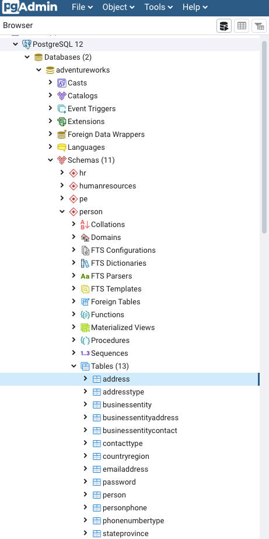
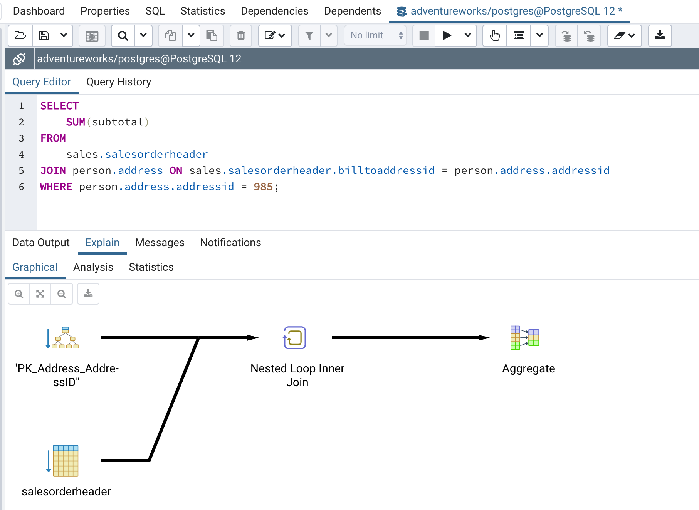
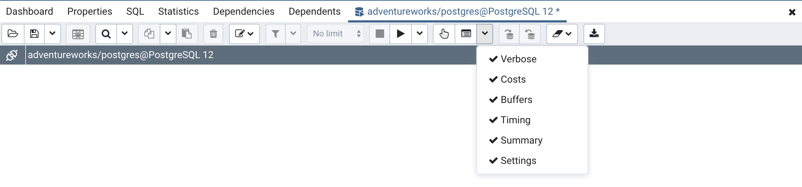
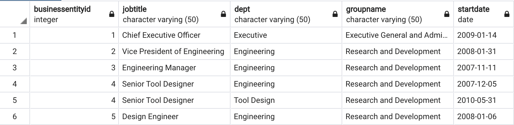
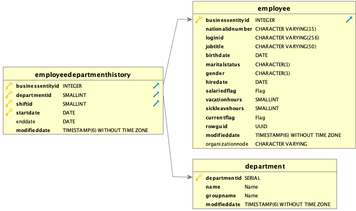
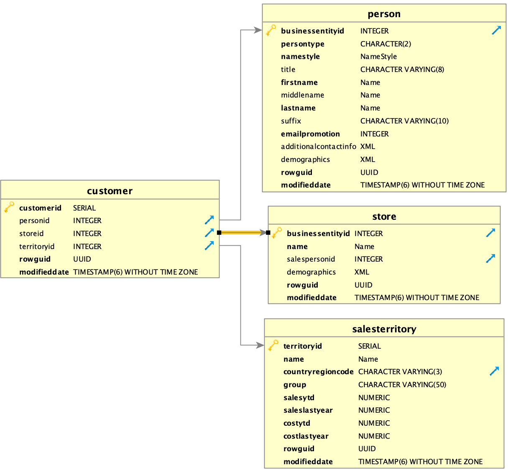
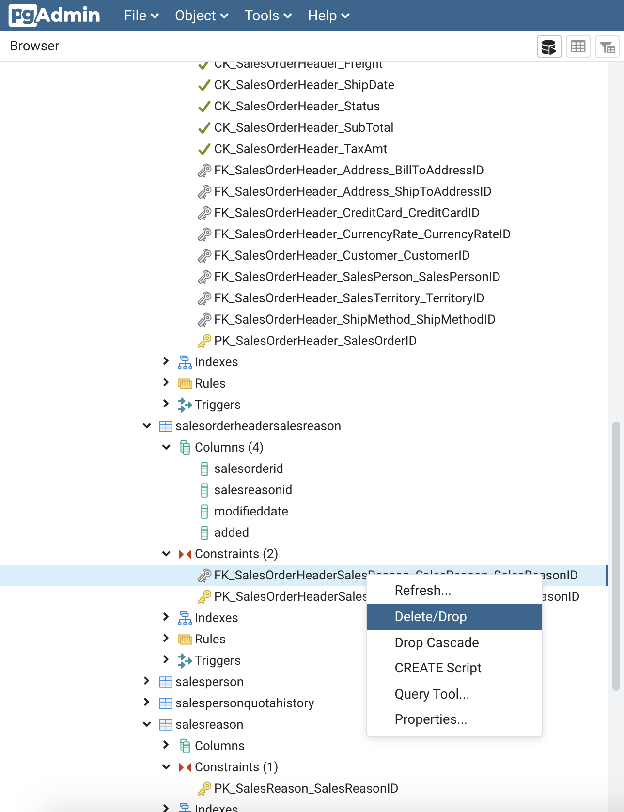

The goal of this programming assignment is to (i) provide hands-on experience running queries on a database system and gain intuition into (ii) how the database system optimizes these queries, and (iii) how you may be able to further improve or tune performance. Once you get going, this assignment should not take very long, but we strongly recommend that you do not wait until the last minute to start!

You will be executing queries on the [AdventureWorks database](https://github.com/microsoft/sql-server-samples/tree/master/samples/databases/adventure-works), and comparing the performance of different queries. AdventureWorks is a sample database developed by Microsoft containing information about a fictitious, multinational manufacturing company. For this assignment, *it is important that you work on the assignment in the order of questions listed below; failure to do so can lead to query execution times that are different from intended.* If all else fails, you should simply drop the database and start from a clean slate. (More on that below.)

Note that for this homework, you will be asked to craft various queries, followed by executing them. Please include as part of your written response ALL of the queries that you have executed corresponding to each step of the instruction.

The response to this assignment needs to be submitted as one single pdf document, named as `programminghw1_CalID.pdf`. We will be using BCourses for collecting the homework assignments. Please submit your answers via BCourses. Hard copies are not accepted. Contact Doris Lee if you are having technical difficulties in submitting the assignment; attempt to submit well in advance of the due date/time. The assignment is due on **3/20 midnight**.

# Installation and Setup 

### Install Postgres (or PostgreSQL)
Download Postgres for your operating system (https://www.postgresql.org/download/). 

Once you have downloaded Postgres, you should start the Postgres server. You will need to set a username and password. Set the password to something you can remember, such as: (DO NOT leave this field empty.)

    Username: postgres
    Password: dbadmin

Note: If you can not run `psql` in the terminal, you may have to add the postgres location into your path. 

    # Print out your postgres path, add it into the PATH variable
    locate psql | grep /bin
    # Add postgres path (You can add this line into your .bash_profile file)
    # Note that the "/Library/..." path may differ depending on your postgres location
    export PATH="/Library/PostgreSQL/12/bin/:$PATH" 

You also want to install [pgAdmin](https://www.pgadmin.org/download/), a database management tool or IDE that runs as a web-based application on top of Postgres. Please follow the pgAdmin installation instructions for your operating system. Once you have pgAdmin installed, you can open it by clicking on the pgAdmin application icon; it should open up the web application (url: `http://127.0.0.1:60943/browser/`) on your browser.

### Uploading the data

1. First create the `adventureworks` database.
```
psql -U postgres -c "CREATE DATABASE \"adventureworks\";"
```

2. In the terminal, go to the directory that contains the `adventureworks.sql` file, downloaded from [here](https://github.com/smithjd/sql-pet/raw/master/book-src/adventureworks.sql). Run this command to load the database into postgres: 
```
pg_restore -d adventureworks  -U postgres adventureworks.sql 
```

3. If you have uploaded the dataset successfully, you should be able to see the database in your psql command line via the command `\list`. 
```
postgres-# \list
                            List of databases
    Name      |  Owner   | Encoding | Collate | Ctype |   Access privileges
----------------+----------+----------+---------+-------+-----------------------
adventureworks | postgres | UTF8     | C       | C     |
postgres       | postgres | UTF8     | C       | C     |
template0      | postgres | UTF8     | C       | C     | =c/postgres          +
                |          |          |         |       | postgres=CTc/postgres
template1      | postgres | UTF8     | C       | C     | =c/postgres          +
                |          |          |         |       | postgres=CTc/postgres
(4 rows)

postgres=# SELECT pg_size_pretty( pg_database_size('adventureworks') );
pg_size_pretty
----------------
112 MB
(1 row)
```

4. For simplicity of query plans across different machines, please turn off the parallel option in Postgres so that the database does not make use of multiple cores. Run this statement in the psql command line after the database is loaded:
```
postgres=# SET max_parallel_workers_per_gather = 0; 
```

Note that this setting is only valid for your current session, remember to rerun this statement if you are disconnected from the database.

5. At any point in the homework, if you find that your database is in a corrupted state, you can run this command to drop all the tables and repeat the steps 1-3 instructions in this section to reload the data.
```
postgres=# DROP database adventureworks;
DROP DATABASE
```
Another helpful tip to note is that none of the queries in this assignment should take more than a few seconds to run. If you find yourself with a query that is running for more than a minute, you might want to terminate the query execution and try again.

### Dataset description

AdventureWorks is a dataset with a fairly complex schema compared to what we have seen in lectures and assignments so far. Schemas with this level of complexity are similar to what you will find in databases in the real world. 

Open up pgAdmin if you haven't already. On the left-hand side of pgAdmin, you will notice that the AdventureWorks database contains hierarchies of tables. In databases with lots of tables, tables are often grouped together into __schema__ to ease with the database organization. You can refer to tables within a particular schema by referring to them with the syntax: `<Schema>.<Tablename>`. For example, `Person.Address` refers to the `Address` table in the `Person` schema as shown in the image below.

</src>

You can query tables within a specific schema similar to how you would query regular tables:

```sql
SELECT city FROM
Person.Address;
```

For simplicity, we will focus only on a small subset of tables. Namely, we will be working mostly with the tables `Sales.Salesorderheader`, `Person.Address`, `HumanResources.EmployeeDepartmentHistory`, and `HumanResources.Department`.


# Question 1 : Understanding Query Plans, Rewriting, and Views (45pt)

### Measure Query Execution Performance
In this assignment, you will be recording the runtime of queries before and after certain operations are run. Please report the before (T) and after (T') raw time in milliseconds, as well as the performance difference, computed as |T-T'|. You will notice that the query run time changes slightly every time you run it, to average out this noise, you can measure a rough average.

### Inspecting Query Plans

Since SQL is a declarative language, the query optimizer figures out the best plan for any given query. You can inspect what the query plan is under the hood by prefixing a query with the special keyword `EXPLAIN ANALYZE` (or pressing F7 on pgAdmin). The output of the `EXPLAIN ANALYZE` query should look similar to the following: 
    
```
adventureworks=# EXPLAIN ANALYZE
    SELECT
        SUM(subtotal)
    FROM
        Sales.Salesorderheader, Person.Address 
	WHERE Sales.Salesorderheader.billtoaddressid = Person.Address.addressid AND Person.Address.addressid = 985;
                                                                QUERY PLAN
-------------------------------------------------------------------------------------------------------------------------------------------------
Aggregate  (cost=1129.78..1129.79 rows=1 width=32) (actual time=7.001..7.001 rows=1 loops=1)
->  Nested Loop  (cost=0.29..1129.75 rows=13 width=7) (actual time=0.050..6.968 rows=12 loops=1)
        ->  Index Only Scan using "PK_Address_AddressID" on address  (cost=0.29..8.30 rows=1 width=4) (actual time=0.033..0.035 rows=1 loops=1)
            Index Cond: (addressid = 985)
            Heap Fetches: 1
        ->  Seq Scan on salesorderheader  (cost=0.00..1121.31 rows=13 width=11) (actual time=0.015..6.928 rows=12 loops=1)
            Filter: (billtoaddressid = 985)
            Rows Removed by Filter: 31453
Planning Time: 0.828 ms
Execution Time: 7.087 ms
(10 rows)
```
You can look at a graphical dataflow graph of the query plan via pgAdmin.
</src>

Note that the query compiler collects some additional information when you do `EXPLAIN ANALYZE`, so you should use `EXPLAIN ANALYZE` to primarily inspect the query plan selected and not when you measure the query execution time. You can measure the query execution time by executing the query directly (F5 on pgAdmin).

On pgAdmin, you can further check these additional options to see more detailed information associated with the query plan:
</src>

Note that query plans resulting from `EXPLAIN ANALYZE` are often hard to understand and not very intuitive, and takes decades to master. (Even the instructors have trouble reading these plans after many years of teaching databases!) Our goal is to not understand every single aspect of the query plan, but to develop a bit of intuition for the plans chosen by the query optimizers, how to read these plans, and also become comfortable with not knowing everything.

a) **[10pt]** Explain in words what Q1 and Q2 are doing. Report and compare the query execution speed of the following two queries. Inspect the two query plans and describe them in your own words. Explain why the execution time and query plan for the two queries are nearly identical. 

Q1:    
```sql
SELECT *
FROM
    Sales.Salesorderheader, Person.Address
WHERE Sales.Salesorderheader.billtoaddressid = Person.Address.addressid 
AND Person.Address.addressid = 985;
```

Q2:
```sql
SELECT *
FROM
    Sales.Salesorderheader,
	(SELECT * 
	 	FROM Person.Address
	 WHERE Person.Address.addressid = 985
	 ) AS address
WHERE Sales.Salesorderheader.billtoaddressid = address.addressid ;
```

b) **[5pt]** Write a SQL statement that produces a view named `vEmployeeTitleDepartmentHistory` that joins together three tables `HumanResources.EmployeeDepartmentHistory`, `HumanResources.Employee`, and `HumanResources.Department` as shown in the following screenshot (this screenshot only shows the first five tuples), and collects employee, department, and employment history together in one view. As part of the query, we also renamed the attribute `name` in the table `HumanResources.Department` as `dept`. For the join condition, we want to ensure that the `businessEntityID` for the `HumanResources.Employee` and `HumanResources.EmployeeDepartmentHistory` tables are equal (since each employee is associated with a `businessEntityID`). In addition, the `departmentID` for `HumanResources.Department` and `HumanResources.EmployeeDepartmentHistory` should be equal for the join condition. 
The screenshot below is a preview of the query result: 
</src>

The figure below graphically depicts how the join operation will operate on the tables, as well
as the attributes of each table:

</src>

Specifically, the figure indicates the attributes that are foreign keys from one relation to the other via
arrows. 

c) **[5pt]** Write two SQL queries to compute the counts of employees for different `groupName` and `jobTitle` where the employees belong to the `Production` department. Write a query that makes use of the view `vEmployeeTitleDepartmentHistory` and another query that does not make use of the view. For the query without views, please write it in a way that does not use subqueries. 

d) **[10pt]** Report the execution time and inspect the query plan. Explain at a high level why the two queries generate the same plan and have approximately the same execution time.  

e) **[2.5pt]** You can create a materialized view via `CREATE MATERIALIZED VIEW <name> AS <query>`. Write a query by modifying the query in 1c to create the materialized view instead, name this as `matvEmployeeTitleDepartmentHistory`. 
    
f) **[2.5pt]** Use the materialized view `matvEmployeeTitleDepartmentHistory` to write the query in 1c.

g) **[10pt]** Inspect the query plans generated by the two queries with and without the use of materialized views. Note that the performance gain may not be significant. Explain how the query plans differ in the two queries, and how and why this differs from what we observed in 1d.  

# Question 2 : Different Flavors of Joins **[20pt]**

In SQL, there are outer, inner, and full joins. Outer joins are further broken down as left and right joins. The different flavors of joins determine whether tuples from one side without matches on the other side are preserved (or not). You can refer to [this tutorial](https://www.w3schools.com/sql/sql_join.asp) for an illustration of the different types of joins, as well as their syntax. The inner join is the type of join we have seen so far, but the left/right outer joins preserve tuples from the left/right-hand side that don’t match tuples on the right/left-hand side, matching them up with null values for missing attributes. The full outer join preserves unmatched tuples from both sides.

a) **[5pt]** Write a query for each of left, right, inner, and full join on the `Sales.Customer` and `Sales.Store` table where the join condition is where `storeid` and `businessentityid` are equal. The figure below graphically depicts how the join operation will operate on the `Sales.Customer` and `Sales.store` table, via `personid` and `businessentityid` as highlighted by the yellow arrow. (You can ignore the other two tables in this diagram.) Measure and report the performance of each query. In addition, report the number of resulting tuples from the different join queries.

</src>

b) **[5pt]** Inspect the query plan for the different join queries. Note how the query plan involves different flavors of hash joins. Describe how the hashing algorithm might work for the different types of join queries.

c) **[5pt]** Explain why the different join queries created tables with different number of resulting tuples. In particular, explain why the inner and right joins resulted in the same table, vice versa for the left and full join. Explain why the performance of the left join is slower than the inner and right join.

# Question 3 : Benefits of Indexes  **[70pt]**

a) **[10pt]** Choice of Index Columns

- **[2.5pt]** Write a query (Q3a) that computes the average of the `subtotal` attribute in the `Sales.Salesorderheader` table for all orders with an address from the city Toronto (from the `Person.Address` table). To ensure that we're talking about the same order, the `billtoaddressid` attribute from `Sales.Salesorderheader` should be equal to the `addressid` attribute in the `Person.Address` table (if you're doing a join or a subquery, for example). Record the query execution time and inspect the query plan. 
- **[2.5pt]** Write a query to add an index on the `city` column in the `Person.Address` table. Record the query execution time of Q3a and inspect the query plan. Explain how the index is used in the query plan.
- **[5pt]** Drop index on `city` and add an index for the `subtotal` column in the `Sales.Salesorderheader` table. Record the query execution time of Q3a and inspect the query plan. Explain why the index on `subtotal` doesn't give as much performance improvement as the `city` index.

Drop the `city` and `subtotal` index after the exercise is completed.

b) **[25pt]** Creating Indexes for Conjunction and Disjunctions
- **[2.5pt]** Building on top of our query Q3a from earlier, write a query that computes the average of `subtotal` in the `Sales.Salesorderheader` table for all orders with an address from the `city` Toronto *and* have `addressid` higher than 450. Note that, like in Q3a this requires a join between the `Person.Address` and `Sales.Salesorderheader` table, where `Sales.Salesorderheader.billtoaddressid` and `Person.Address.addressidRecord` are equal (or this can be accomplished by a subquery). Record the query execution time and inspect the query plan. 
     - Add an index for  `city`. Record the query execution time and inspect the query plan. Drop the index on `city` after this exercise.
 - **[2.5pt]** Write a query that computes the average of `subtotal` in the `Sales.Salesorderheader` for all orders with an address from the `city` Toronto *or* have `stateprovinceid` is equal to 34. Record the query execution time and inspect the query plan.
    - Add an index for `city`. Record the query execution time and inspect the query plan. Drop the index on `city` after this exercise.
- **[10pt]** Explain why the AND query made use of the index but not the OR query did not.  
- **[2.5pt]** You can create a *multicolumn index* on more than one column in a table by separating the column names with comma within the parenthesis as follows:
    ```sql
    CREATE INDEX index_name
    ON table_name(a,b,c,...);
    ```
    - Write a query to create a multicolumn index on `city` and `addressid` then measure the performance.
    - Run the OR query from earlier. Record the query execution time and inspect the query plan. 
- **[10pt]** Explain the differences between the query execution plan with only a single index on `city` versus the one with the multicolumn index. In particular, exaplain how the multicolumn index was used in the query execution.

c) **[10pt]** Cost of Index Maintenance : 

We need to do some setup to the database up for this question. First, we create an extra column to keep track of the records that we will be adding to the database.
```sql
ALTER TABLE Sales.Salesorderheadersalesreason ADD added boolean DEFAULT False;
```
Next, we delete the two foreign key constraints on the table. We do this by right clicking on the constraints and pressing 'Delete/Drop' as shown in the screenshot below. Do this for both the `FK_SalesOrderHeaderSalesReason_SalesOrderHeader_SalesOrderID` and `FK_SalesOrderHeaderSalesReason_SalesReason_SalesReasonID` constraints.
</src>

- **[2.5pt]** 
Run the update script below. Note that this script performs a series of random inserts to the table. Record the query execution time.

```sql
DO $$
DECLARE counter INTEGER := 1;
BEGIN
    FOR counter IN 100000..150000 LOOP
    INSERT INTO Sales.Salesorderheadersalesreason (salesorderid, salesreasonid, modifieddate, added)
        VALUES (counter, RANDOM()*10, '2011-06-15 00:00:00', True);
    END LOOP;
END;
$$;	
```
- Run the script below to drop the tuples inserted by the update script to make sure that the database is back to a clean slate. 
    ```sql
    DELETE FROM Sales.Salesorderheadersalesreason
    WHERE added = 'true';    
    ```
-  **[2.5pt]** Write a query that adds an index on the `salesreasonid` column. Run this query to build the index.
- **[5pt]** Run the update script again, record the query execution time. Explain why the query runtime is slower after the creation of the index.

d) **[15pt]** Effect of cardinality on indexes 
- **[2.5pt]** Write two queries that computes the total number of distinct values on the column `onlineorderflag`, `territoryid`, and `accountnumber` on the `Sales.Salesorderheader` table. This is known as the *cardinality* of the column. Report the cardinality of each column. 
- **[2.5pt]** Write and execute queries that find all tuples in the table `salesorderheader` where : 
    - Q1: `onlineorderflag` is True
    - Q2: `accountnumber` is '10-4030-025863'
    - Q3: `territoryid` is 2
    - Record the execution time for each query.

- **[2.5pt]** Write queries to build the following index. Compute and report the performance gain of Q1-3 before and after the index is built. Inspect the query plans for the three queries. 
  - Build an index on `onlineorderflag` and record the runtime of Q1
  - Build an index on `accountnumber` and record the runtime of Q2
  - Build an index on `territory` and record the runtime of Q3
- **[2.5pt]** Explain why the index is not used for `onlineorderflag` by describing the relationship between cardinality and indexes. 
- **[5pt]** Given that in 3c we know that there is a maintenance cost of indexes, in general, what is the best type of column to build indexes on (low v.s. medium v.s. high cardinality) to ensure good performance for both reads and writes to the database?
    - Bonus Exercise: You can try plotting a line chart of performance gain v.s. cardinality (with cardinality x-axis as log-scale). To better inspect the trend, you can try this on columns of various cardinality (such as `salespersonid`, `salesorderid`). 