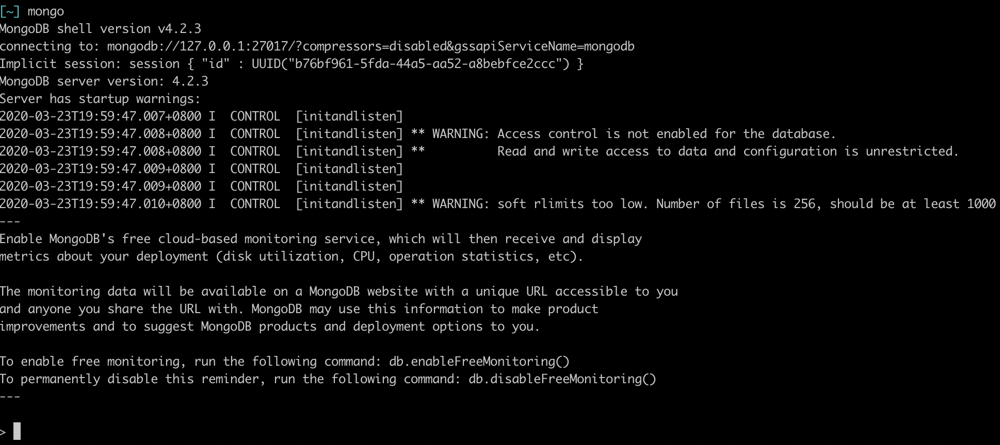
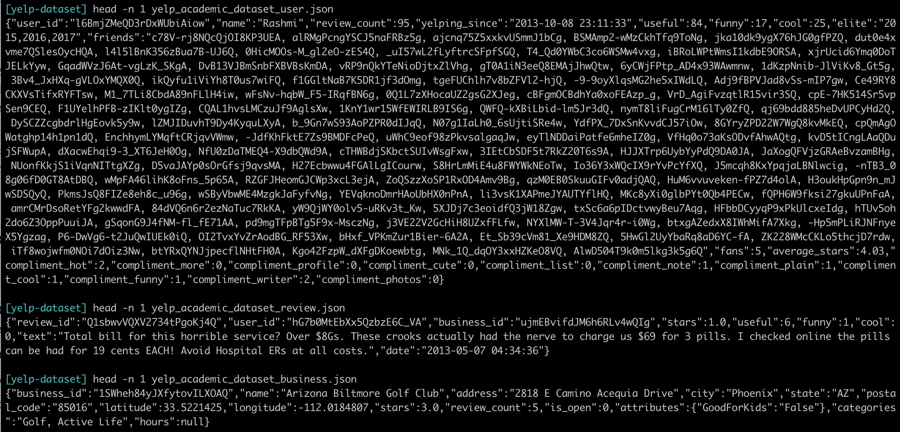

The goal of this programming assignment is to (i) provide hands-on experience with working with unstructured data via MongoDB, (ii)  perform basic data cleaning and integration, and (iii) data exploration and visualization through Pandas. Once you get going, this assignment should not take very long, but we strongly recommend that you do not wait until the last minute to start!

You will be working with the [Yelp](https://www.kaggle.com/yelp-dataset/yelp-dataset) dataset. The Yelp dataset is a large dataset consisting of reviews of businesses, business, and user information.

Note that for this homework, you will be asked to craft various queries, followed by executing them. Please include as part of your written response ALL of the queries that you have executed corresponding to each step of the instruction, as well as any additional information requested in the specific questions.

The response to this assignment needs to be submitted as one *single pdf* document, named as `programminghw2_CalID.pdf`. We will be using BCourses for collecting the homework assignments. Please submit your answers via BCourses. Hard copies are not accepted. If you are submitting code files or notebooks as your responses, please *clearly mark* which lines of code correspond to which question number *in the correct question order*. Exclude any code that is not relevant to the what is asked by the question. Failure to write up your solutions properly may result in grades deducted for the missed questions. Contact Doris Lee if you are having technical difficulties in submitting the assignment; attempt to submit well in advance of the due date/time. The assignment is due on **4/27 midnight**.

Feel free to talk to other members of the class in doing the homework. You should, however, write down your solutions yourself. List the names of everyone you worked with at the top of your submission.


# Installation and Setup 

### Install and Setup MongoDB (for Q1)

Follow the [instructions](https://docs.mongodb.com/manual/installation/) on the MongoDB website to install MongoDB for your operating system. Mac users can install MongoDB via homebrew: 

	brew tap mongodb/brew
	brew install mongodb-community@4.2

To start running MongoDB as a background process, issue the following command on the terminal: 

	mongod --config /usr/local/etc/mongod.conf --fork

After starting MongoDB, you should be able to access the MongoDB shell via the command `mongod` as follows. You will be submitting your queries for Q1 in the assignment through this Mongo shell (or via Jupyter, described later).

</src>

### Uploading the data to MongoDB (for Q1)

Download the [Yelp dataset from Kaggle](https://www.kaggle.com/yelp-dataset/yelp-dataset). Note that this file is very large and will take a few minutes to download. Navigate into the directory where the downloaded file is located at and enter the following command in the terminal. We will only be working with the `reviews`, `user`, and `business` dataset. Here is a single-line sample of the contents of the data:
</src>


The collection `reviews` contains reviews, the user id of the users who have submitted the review, and the business id of the business that the review is about. The collection `business` contains a business id along with some information associated with the business. The detailed information of each data field can be found in [this online documentation](https://www.yelp.com/dataset/documentation/main). For simplicity, we will only be working with `business.json`, `reviews.json`, and `user.json`. The JSON files can be imported into Mongo using the following commands on the terminal:

	mongoimport -d yelp -c review yelp_academic_dataset_review.json

	mongoimport -d yelp -c user yelp_academic_dataset_user.json 

	mongoimport -d yelp -c business yelp_academic_dataset_business.json

After importing the data into MongoDB, we can enter the mongo shell (via `mongo`) to check that the collections in the `yelp` database are loaded correctly.

	$ mongo
	MongoDB shell version v4.2.3
	...
	> show dbs
	admin   0.000GB
	config  0.000GB
	local   0.000GB
	yelp    5.739GB

	> use yelp
	switched to db yelp

	> show collections
	business
	review
	user

### Install Python and relevant packages (for Q2 and Q3)

1. Follow [these instructions](https://www.python.org/downloads/) to install Python.
Skip this step if you already have Python installed. 
2. Run `pip install pandas pymongo` on the command line to install the Pandas and PyMongo packages.

3. (Optional) You might be interested in using [Jupyter](https://jupyter.org/) notebook as the development environment when doing data preparation and visualization. Though the use of Jupyter notebooks for this homework is optional, you may find that the environment makes working with data a lot easier. 

# Question 1 : Working with Unstructured Data in MongoDB (40pt)
a) **[10pt]** Inspect the three collections `business`, `review`, and `user` as such, via the `$limit` command.

	> db.business.aggregate({ $limit: 2 });

	{ "_id" : ObjectId("5e79833db76770defa12ed82"), "business_id" : "1SWheh84yJXfytovILXOAQ", "name" : "Arizona Biltmore Golf Club", "address" : "2818 E Camino Acequia Drive", "city" : "Phoenix", "state" : "AZ", "postal_code" : "85016", "latitude" : 33.5221425, "longitude" : -112.0184807, "stars" : 3, "review_count" : 5, "is_open" : 0, "attributes" : { "GoodForKids" : "False" }, "categories" : "Golf, Active Life", "hours" : null }
	{ "_id" : ObjectId("5e79833db76770defa12ed83"), "business_id" : "HhyxOkGAM07SRYtlQ4wMFQ", "name" : "Queen City Plumbing", "address" : "4209 Stuart Andrew Blvd, Ste F", "city" : "Charlotte", "state" : "NC", "postal_code" : "28217", "latitude" : 35.1900119, "longitude" : -80.8872232, "stars" : 4, "review_count" : 4, "is_open" : 1, "attributes" : { "BusinessAcceptsBitcoin" : "False", "ByAppointmentOnly" : "True", "BusinessAcceptsCreditCards" : "True" }, "categories" : "Plumbing, Shopping, Local Services, Home Services, Kitchen & Bath, Home & Garden, Water Heater Installation/Repair", "hours" : { "Monday" : "7:0-23:0", "Tuesday" : "7:0-23:0", "Wednesday" : "7:0-23:0", "Thursday" : "7:0-23:0", "Friday" : "7:0-23:0", "Saturday" : "7:0-23:0", "Sunday" : "7:0-23:0" } }
If you were to store this into a relational database, how would you store it? List a sketch of the schema.
List two benefits for storing this data in a NoSQL database like MongoDB over a relational database management system (RDBMS) such as Postgres. Please point to specific characteristics regarding the Yelp dataset in your explanation. (Hint: Think about what information would be hard to model or lost if this data was stored in a RDBMS.)

For Q1b-d, please perform the following: 

- i) using the schema you sketched earlier, briefly explain how this query would be done in a relational setting (a sketch is sufficient, rather than a full-fledged SQL query),
- ii) write down the MongoDB query used to address the question,
- iii) attach a snippet of the query result for the first five documents via `{ $limit: 5 }`. If there are less than 5 results, then attach the entire resultset.

b) **[10pt]** Basic Filter and Aggregation: 

Compute the average star rating of every state for businesses that has more than 500 reviews (`review_count` larger than 500). (Hint: This can be done through a pipeline of operations via the [aggregate](https://docs.mongodb.com/manual/reference/method/db.collection.aggregate/) method.)

c) **[5pt]** Working with multiple collections: 

The [`$lookup`](https://docs.mongodb.com/manual/reference/operator/aggregation/lookup/) command can be used to match between documents in an input collection and another collection. Explain what the following query Q1 and Q2 is doing. 

	Q1: db.review.aggregate([
		{
			$lookup:
			{
				from: "business",
				localField: "business_id",
				foreignField: "business_id",
				as: "business_info"
			}
		}
	])

	Q2: db.business.aggregate([
		{
			$lookup:
			{
				from: "review",
				localField: "business_id",
				foreignField: "business_id",
				as: "review_info"
			}
		}
	])
What happens when you run the queries Q1 and Q2? (Hint: One of these queries should take an extrodinarily long time to run. You can kill this query by entering Ctrl+C in the Mongo shell.) Explain conceptually why this query takes so long and how this is different from doing a join in a relational setting. 

d) **[10pt]** Working with text: 

We will be working with the `review` collection. The `review` collection is around 4GB, accounting for most of the size in the `yelp` database. For the following exercise, we will only be working with a sample of this `review` dataset so that it fits in memory.

First, we sample 5000 reviews from the `review` and export it into another collection called `sample_review`. 

	db.review.aggregate(
		[ { $sample: { size: 5000 } } ,
		{$out: "sample_review"}]
	)

One of the benefits of using MongoDB is that it provides a fast and convenient way of working with unstructured text data, like what we have in the `text` field in the `sample_review` collection.
In order to leverage the text search capabilities in MongoDB, we must first build a text index on the `text` field as follows. 

	db.sample_review.createIndex( { text: "text" } )

We want to perform a crude sentiment analysis to figure out whether the content of these reviews are positive. We say that a review is positive if it contains any of the following words `amazing, high, great, clean, good, delicious, excellent`. Write a query that returns a list of reviews that contain these positive words. (Hint: look at how to use the [$text](https://docs.mongodb.com/manual/text-search/) query operator to perform text searches.)

e) **[5pt]**  Writing to a collection: 

Using the query from Q1d, we want to create a boolean field in the `sample_review` collection called `positiveFlag` that specifies whether or not the review contains the positive words. (Hint: You can use [`update`](https://docs.mongodb.com/manual/reference/method/db.collection.update/) to modify/add to the collection.)

f) **[5pt]**  Deleting Fields: 

Now that we have extracted a feature that we are interested in from the review content, write a query that drops the `text` field from the `sample_review` collections. To speed things up, you can also drop the `friends` field in the `user` collection. You can use `db.sample_review.dataSize()` to check the size of the collection before and after, note how there is around a four-fold decrease in memory after the text field is dropped. (Hint: You can also use the [`update`](https://docs.mongodb.com/manual/reference/method/db.collection.update/) command to delete the field.)

# Question 2 : ETL with Pandas (30pt)
In the second part of this assignment, we will be exporting the `business`, `user`, and `sample_review` collections in MongoDB into Pandas. [Pandas](https://pandas.pydata.org/) is a Python package that allows you to work with relational-like data through a data structure called _dataframes_. Pandas is widely adopted by data scientists for data loading, wrangling, cleaning, and analysis.

a) **[5pt]** Export MongoDB collection to Pandas: 

We are now going to export the three MongoDB collection `business`, `user`, and `sample_review` into three separate Pandas dataframes. Execute the following Python commands in your Jupyter notebook or Python IDE.
```python
from pymongo import MongoClient
import pandas as pd
# Connect to MongoDB
conn = MongoClient("localhost",27017) #type in `mongod` on the terminal to find your port number
db = conn["yelp"]
# Query individual collections
query = {}
business_cursor = db["business"].find(query)
review_cursor = db["sample_review"].find(query)
user_cursor = db["user"].find(query)

# Load the collections into Pandas. 
from pandas.io.json import json_normalize
user_df = json_normalize(user_cursor)
review_df = json_normalize(review_cursor)
business_df = json_normalize(business_cursor)
```
Note how the Pandas `json_normalize` command expands nested fields such as `{"attribute":["DriveThru": true]}` into `attribute.DriveThru`. Inspect the dataframes `user_df`, `business_df`, `review_df`, and describe how the dataframe representation differs from the document representation in MongoDB? (Hint: What do you notice about the `attribute.*` columns?)

b) **[5pt]** Joining Dataframes:

Write a Pandas query that combines `user_df`, `business_df`, `review_df` into one single dataframe called `combined_df`. (Hint: You should first remove the '_id' column in each dataframe, then use the [merge](https://pandas.pydata.org/pandas-docs/stable/reference/api/pandas.DataFrame.merge.html) command to combine dataframes.) This can span multiple statements. State the number of columns in each dataframe, as well as the number of columns in the resulting joined table.

c) **[10pt]** Deriving new fields and dealing with null values: 

We observe how due to the nested representation of the data, there is a lot of missing fields with NaN values in the Pandas dataframes. To ease our analysis, we want to get rid of columns that have too many rows with NaN values. First, compute the percentage of NaN values for each column (Hint: You could use the [isnull](https://pandas.pydata.org/pandas-docs/stable/reference/api/pandas.isnull.html) command to determine what is a NaN value.). Then, plot the histogram distribution the percentage of NaN values across all columns (via `.hist()` function). We will notice that there is a large number of columns that do not have any non-null values. Write a query that keeps only columns with more than 20% non-null values in the `combined_df` dataframe. State the number of columns left in the resulting table.

d) **[10pt]** Reflect on your experiences with using MongoDB, Pandas, and SQL (from the previous assignment). Comment on the pros/cons of these tools based on their programmability/usability, expected performance, data model/representation, and any additional axes of comparison. In particular, consider what tool(s) you would pick for certain tasks or scenarios that you might encounter in various real-world applications? (e.g., working with nested data, text data, or data with many different types of fields, performing joins on wide tables, processing data that doesn't fit in-memory)

# Question 3: Analysis and Visualization (30pt)

For the following questions, please create a visualization that best address the question. Explain in words the insights conveyed by the visualization, include a justification of why you chose the specific type of visualization or any additional considerations that is not captured by the visualization. We will be using the default [`df.plot`](https://pandas.pydata.org/pandas-docs/version/0.23.4/generated/pandas.DataFrame.plot.html) functionality in Pandas, as well as custom visualization through the [`matplotlib`](https://matplotlib.org/) package. Please attach the visualization generated as part of the submission document.

a) **[10pt]** Visualizing Comparisons: 

Working with the `review_df` from Q2, we want to understand whether reviews marked with a `positiveFlag` tend to have higher average `stars` rating than compared to ones without a `positiveFlag`. Try using the `df.plot` first, does this default visualization suffice to address this question? If not, please generate the appropriate visualization using `pandas` and `matplotlib`, justify your choice of visualization, and interpret the visualization result in words. (Hint: You may need to fill the NaN value in `positiveFlag` as False.)

b) **[5pt]** Pandas is not suitable for data that does not fit in-memory. If you are working with a large dataset stored in a database, what SQL query will you issue to the database to generate the raw data required for the visualization in Q3a? (You can describe the rough extended relational algebra operators required to compute this data. It is not necessary to write a complete SQL query for this question.) 

c) **[10pt]** Understanding Distributions of Data Subsets:

 We want to understand what is the distribution of `stars` across businesses that are in the state of Nevada (`NV`) and are restaurants that allow take out (`attributes.RestaurantsTakeOut`). As in the earlier question, if `df.plot` does not suffice, please generate the appropriate visualization using `pandas` and `matplotlib`, justify your choice of visualization, and interpret the visualization result in words.

d) **[5pt]** Similar to Q3b, explain how you would compute the data required to generate the visualization for Q3c in a relational setting.
